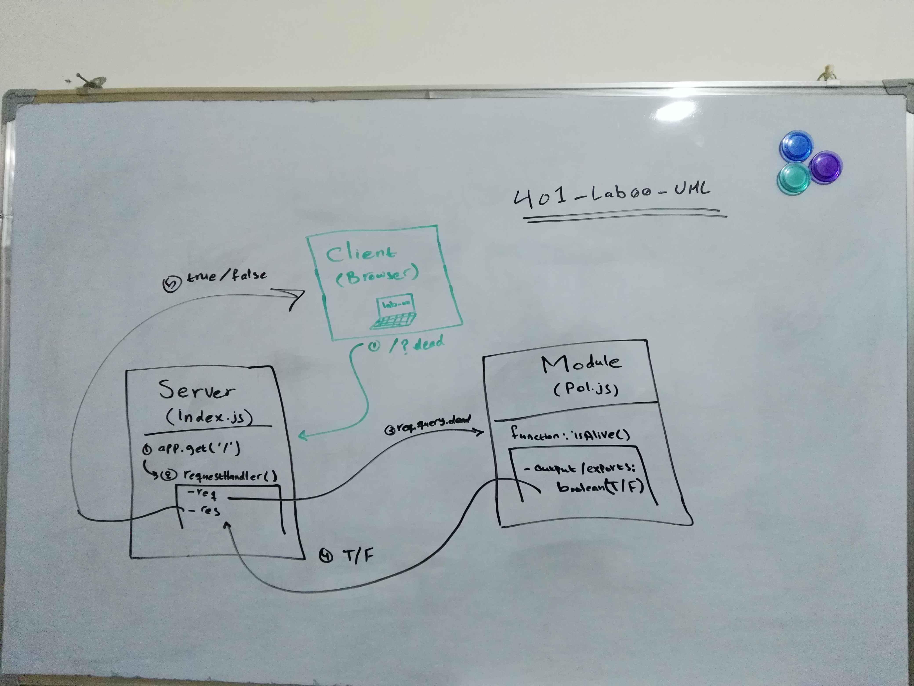

# LAB 00 - Class 00

## Project: Proof of Life Server

### Author: Bushra Bilal

### Links and Resources

- [submission PR](https://github.com/bushra-401-advanced-javascript/lab-00/pull/1)
- [ci/cd](https://travis-ci.com/github/bushra-401-advanced-javascript/lab-00/builds/165244364) (Travis-CI)
- [front-end application](https://bushrabilal-401-lab-00.herokuapp.com)

### Documentation

- [jsdoc](https://bushrabilal-401-lab-00.herokuapp.com/docs/)

### Modules

#### `pol.js`

##### Exported Values and Methods

###### `isAlive(dead) -> boolean`
  - Returns true/false to indicate how the server works

### Setup

#### `.env` requirements 

- `PORT` - 3000

#### How to initialize/run your application 

- `npm start`
- Endpoint: `/`
  - Returns a boolean
- Endpoint: `/docs`
  - Returns JSDoc Documentation pages

#### How to use your library (where applicable)

#### Tests

- Unit Tests: `npm test`
- Lint Tests: `npm run lint`

#### UML

